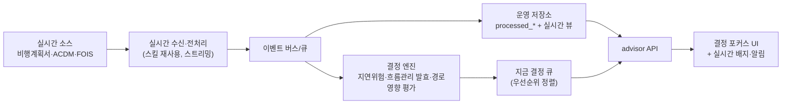

# 10. UI 방향(결정 중심) + 향후 실시간 의사결정 아키텍처

- 문서 버전: 1.0
- 작성일: 2026-07-21
- 대상: 프론트 설계자·기획자
- 관련 문서: [01-architecture](./01-architecture.md), [03-backend-api](./03-backend-api.md), [04-frontend-migration](./04-frontend-migration.md), [00-plan](./00-plan.md)
- 시각 동반물: UI 디자인 제안 Artifact(별도 링크로 공유)

이 문서는 완성본 지도(`완성본_전세계_항공로_지도.html`)를 참조하되 **의사결정자 관점에서 최적화한 UI 방향**과, **향후 실시간 의사결정 지원 아키텍처**를 저장소에 확정한다.

## 1. 문제의식 — 완성본 대비

완성본은 전세계 항공로·픽스·공항을 **상시 전부** 그린다(25만+ 도형). 데이터 감상·탐색에는 좋지만, **"이 비행을 어느 루트로 보낼까"를 결정**하는 사용자에게는:
- 정보 과부하 — 결정과 무관한 전세계 요소가 화면을 채운다.
- 결정 경로가 길다 — 원하는 OD·루트를 찾기까지 탐색 비용.
- 초기 로딩·렌더 비용(15MB 임베드).

## 2. UI 원칙 — "결정 포커스"

**전세계 지도는 보유하되 기본이 아니다.** 기본 화면은 **사용자가 지금 의사결정하는 OD·후보 루트에 해당하는 FIR·항공로만** 선택적으로 표시하고 자동 fit-bounds 한다.

### 2.1 3 뷰 모드 (토글)
| 모드 | 표시 | 용도 |
|---|---|---|
| **결정 포커스**(기본) | 선택 OD·후보 루트의 경유 FIR·항공로·트랙만 | 루트 비교·선택 |
| 지역 컨텍스트 | 인천 FIR + 인접 FIR, 관련 섹터 | 주변 상황 파악 |
| 전세계 | 완성본과 동일(전 레이어) | 탐색·전체 조망(온디맨드) |

- 전세계 데이터는 **버리지 않는다** — `/api/reference/*`로 **온디맨드 로드**([03](./03-backend-api.md)), 모드 전환 시 필요한 범위만 가져온다.
- 결정 포커스는 선택된 `enroute_firs`·`track_coords`·`full_route_coords`(ODR2, [02](./02-db-integration.md))만 그리므로 도형 수가 급감 → 성능·모바일 유리.

### 2.2 화면 레이아웃 (제안, MVP/2단계 구분)
```
┌────────────────────────────────────────────────────────────┐
│ 상단바: 타이틀 · 실시간 배지(수신 상태·결정 큐 N건) · 뷰모드  │   ← 배지·결정 큐는 향후 단계(§3), MVP는 타이틀·뷰모드만
├───────────────┬──────────────────────────┬─────────────────┤
│ 결정 패널(좌)  │      포커스 맵(중앙)       │ 의사결정 근거(우) │
│ · 출발/도착    │  선택 FIR·루트만, fit    │ · 경유 FIR 체인   │   ← MVP(ODR2 enroute_firs)
│ · 후보 루트    │  bounds, 루트 강조        │ · 상층풍/시어     │   ← 2단계(04-E)
│   (편수·평균   │                          │ · 지연원인(FOIS) │   ← 2단계(03 §4.3)
│    소요·지연수)│                          │ · 흐름관리 영향   │   ← 2단계(03 §4.4)
│ · 필터         │                          │                  │
├───────────────┴──────────────────────────┴─────────────────┤
│ (선택) 미니맵: 전세계 상 현재 포커스 위치 표시 — 맥락 유지     │   ← MVP(F10)
└────────────────────────────────────────────────────────────┘
```
> MVP는 "후보 루트"에 ODR2 자체 필드(편수·평균 소요·지연수·HEAVY수, [03 §4.1](./03-backend-api.md))만 표시한다. "정시성"(ACDM 유래 on-time rate)·상층풍/시어·지연원인(FOIS)·흐름관리 영향은 **2단계**(03 §4.2~4.4, 05 §3) 진입 후 우측 패널에 추가한다. MVP 우측 패널은 "경유 FIR 체인"만 채운다.

### 2.3 "선택적 표시" 설계 평가
- **장점**: 결정 집중, 정보 과부하↓, 클릭 수↓, 렌더 도형↓(성능/모바일), 실시간 우선순위 노출 용이.
- **리스크**: 전체 맥락 상실("주변에 뭐가 있는지") → **완화**: (a) 우상단 미니맵에 전세계 상 포커스 위치, (b) 원클릭 "전세계" 토글, (c) 지역 컨텍스트 모드.
- **완성본 자산 보존**: 전 레이어 데이터·렌더 알고리즘(04-A)은 그대로. 표시 범위만 결정 주도로 제어 → 완성본은 "전세계 모드"로 흡수.

### 2.4 FIR·항로 함께 표시 (결정됨)
결정 포커스 기본 화면은 경유 **FIR 면 + 그 안의 ATS 항로(항공로) 네트워크**를 함께 그리고, 그 위에 선택 루트를 강조한다. 항로는 옅은 ink-soft로 배경처럼, 선택 루트는 orange로 전경. 지역 컨텍스트/전세계 모드로 갈수록 항로 표시 범위가 넓어진다.

### 2.5 기상 자료 표시 (계층형 — 결정 영향 순서)
원칙: **결정 영향 순서로 계층화**, 위험도 색(초록/주황/빨강)은 **브랜드 accent(orange/blue)와 분리**, 기본 최소·상세는 토글/클릭. 지도(공간)와 우측 근거 패널(수치)의 역할을 분리한다.

| 레이어 | 표시 | 기본 | 단계 |
|---|---|---|---|
| ① 경로 위 시어·상층풍 | 선택 루트 세그먼트를 CAT 시어 등급 색(≤4 초록/4–7 주황/>7 빨강), 고도 변경 시 갱신 + 우측 패널 ★추천 고도 | 미표시(2단계 전) | **2단계**(04-E, Open-Meteo — [00 §3](./00-plan.md), [05 §3](./05-mvp-scope.md) 상층풍·시어 오버레이) |
| ② 공항 기상 카테고리 | 출·도착점 VFR/MVFR/IFR/LIFR 색 뱃지 + 클릭 시 METAR/TAF 팝업 | 항상 | MVP — 구현됨(`frontend/js/weather.js`, F7) |
| ③ 경유 FIR 심각도 | 포커스 FIR 면에 강수·위험 틴트(경유 FIR만, 전세계 아님) | 항상 | **2단계로 이관**(2026-07-22 완료검증에서 발견 — [05 §2.2](./05-mvp-scope.md) F1~F10 작업분해에 대응 항목이 없어 미구현 상태로 남아있었음. RainViewer 격자 샘플링→FIR 강수%는 04-G/07 "FIR 기상 심각도" 알고리즘 이식이 필요해 04-E 상층풍과 유사한 별도 작업으로 분리) |
| ④ 위험기상(SIGMET/PIREP) | 지도에 SIGMET 폴리곤·PIREP 마커 토글 표시(클릭 시 팝업) | 조건부(기본 OFF) | **부분 구현됨**(2단계, 2026-07-23, `frontend/js/layers/hazards.js`) — "루트 교차 시 지도 경고 마커 + 근거 패널 칩(TS·ICE·TURB)"(교차판정 로직)은 원본에 판정 알고리즘 근거가 없어 미구현으로 남김(허위 정보 생성 금지 원칙, [07-checklist](./07-checklist.md) "향후 확장" 참고) |
| ⑤ 기상 레이더(RainViewer) | 토글 레이어 + 재생 바(과거 2h). 결정 포커스 기본 OFF, 온디맨드 | 토글 | **구현됨**(2단계, 2026-07-23, `frontend/js/layers/radar.js`) |

- MVP(①③④⑤ 제외)는 기존 Node 기상서버·ADS-B — **신규 백엔드 개발 없이** 브라우저 직접/프록시 호출로 충족([03 §5](./03-backend-api.md)). ①(시어·상층풍·추천고도)은 Open-Meteo 연동·세그먼트 계산이 필요한 04-E 작업이라 처음부터 2단계였고, ③④⑤(FIR 기상 심각도·SIGMET/PIREP·레이더)는 **애초 MVP로 표기됐으나 F1~F10 작업분해에서 누락돼 미구현 상태로 완료검증까지 갔다가 2단계로 재분류**됐다(문서-작업분해 불일치, 향후 F1~F10류 새 작업 분해 시 이 표와 반드시 교차 확인할 것).
- 데이터 출처: 원본 `문서/03·04·07`(공항 기상=기상서버 METAR/TAF, 시어·상층풍=Open-Meteo[2단계], 레이더=RainViewer[2단계], SIGMET/PIREP=기상서버 `isigmet`/`pirep`[2단계]). 외부 API 폴백·CORS 규약은 [06](./06-conventions.md) 유지.
- 우측 근거 패널: MVP는 "경유 FIR 체인"만(§2.2). 배풍/정풍·측풍·시어 등급·★추천 고도(①)는 여전히 2단계 미착수. **지연원인(FOIS)은 2026-07-23 라이트 연동으로 노선 선택 시 출/도착 공항 FOIS 상위 원인을 이 패널에 자동 표시**(`frontend/js/route-fois-summary.js`, `#route-fois-summary`) — 단 FOIS는 노선(OD) 단위가 아니라 공항 단위 집계라 "참고 정보"로만 노출하고 경로 순위/추천 근거로는 아직 쓰지 않는다(심화 여부는 실사용 후 판단, [07-checklist §향후확장](./07-checklist.md) 계획 참고). 흐름관리 상태는 여전히 별도 패널(FOIS 지연원인 아래 "흐름관리 조치")로만 존재, 근거 패널에는 미연동.

### 2.6 디자인 토큰 계승
ink `#22303c` · ink-soft `#7a8a99` · paper `#fbfbf9` · orange `#e8590c` · blue `#1d5fae`, Pretendard + IBM Plex Mono(원본 §5). 상단바 57px 톤 유지.

> 프론트 구현 반영: [04 §6](./04-frontend-migration.md) 레이어 표시를 "결정 포커스 기본 + 전세계 온디맨드"로 운용(원본 04-A 렌더 보존).

## 3. 향후 단계 — 실시간 의사결정 지원 (설계만, MVP 아님)

현 MVP는 배치(수동 업로드→적재→조회)다. 향후 **실시간 수신** 단계에서, 비행계획서·ACDM·FOIS 전처리 데이터가 실시간 도착하면 이를 기반으로 **즉시 의사결정**할 수 있는 구조를 둔다.

### 3.1 아키텍처



### 3.2 "지금 결정 큐" (실시간 UI의 핵심)
상단 실시간 배지 + 좌측 결정 패널 상단에 **우선순위 큐**를 띄운다.
- 임박 출·도착(EOBT/ELDT 근접), 지연 위험 상승(ACDM 예측·FOIS 사유 발생), 흐름관리 발효(적용 시각 도래), 경로 영향(SUAS/기상) 이벤트.
- 각 항목 클릭 → 해당 OD·루트로 **결정 포커스 맵 자동 전환** → 근거 패널 표시 → 대안 루트 추천.

### 3.3 배치→실시간 전환 시 유지 원칙
- 전처리 로직은 **재사용**(스킬), 수신만 배치→스트리밍으로.
- `processed_*` append-only·`run_id`·최신본 규약은 유지, 실시간은 "최근 창(window)" 뷰를 추가.
- 읽기 전용 소비·시큐어코딩·하드코딩 금지 원칙 동일 적용([06](./06-conventions.md)).

### 3.4 로드맵 위치
[00-plan 로드맵](./00-plan.md)의 **향후 단계**(3단계 이후)로 둔다. 현 MVP(1단계)는 배치 유지. 실시간은 이벤트 버스·결정 엔진이라는 신규 컴포넌트가 필요하므로 별도 설계·검증 단계로 분리한다.
